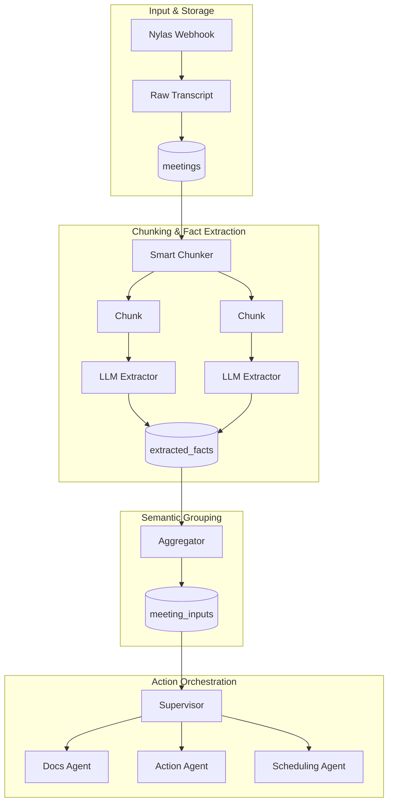

# SmartMeetOS

SmartMeetOS watches **Google Calendar** for **Google Meet** events and automatically triggers a **Nylas Notetaker** workflow to join meetings, record transcripts, extract insights, and deliver actionable outputs.

It transforms meetings into structured knowledge: documentation, tasks, follow-ups, and calendar actions — delivered via **Notion, Discord, SMS, or email**.

---

## Table of Contents

* [Overview](#smartmeetos)
* [Features](#features)
* [Requirements](#requirements)
* [Installation](#installation)
* [Configuration](#configuration)
* [Project Structure](#project-structure)
* [Usage](#usage)

  * [Calendar Watcher](#1-calendar-watcher-main-process)
  * [Dashboard (Web UI)](#2-dashboard-streamlit-web-ui)
  * [Manual Meeting Processing](#3-manual-meeting-processing)
* [Architecture](#architecture)

  * [Architecture Diagram](#architecture-1)
  * [Architecture Diagram — Explanation](#architecture-diagram--explanation)
* [Operational Notes](#operational-notes--key-files)

---

## Features

✨ **Core Capabilities**

* 🗓️ **Calendar Monitoring** — Real-time polling of Google Calendar for Meet events
* 📝 **Automatic Transcription** — Nylas Notetaker joins meetings and records transcripts
* 🧠 **AI-Powered Processing** — LLM extraction of facts, decisions, and action items
* 📊 **Semantic Grouping** — Intelligent clustering and conflict resolution
* 📄 **Auto Documentation** — Generate structured meeting notes in Notion
* ⚡ **Task Management** — Automatic follow-ups and task creation
* 💬 **Multi-Channel Delivery** — Discord, SMS, email, or Notion
* 🔄 **Webhook Integration** — Real-time transcript ingestion via Nylas webhooks
* 🗄️ **Meeting History** — SQLAlchemy-backed persistent storage

---

## Requirements

* **Python 3.10+** (3.11+ recommended)
* **Google Calendar OAuth credentials** (JSON file)
* **Nylas API account** (API key + Grant ID)
* **SQLite or PostgreSQL** database

---

## Installation

1. Clone the repository:

```bash
git clone https://github.com/glorynino/SmartMeetOS.git
cd SmartMeetOS
```

2. Create and activate a virtual environment:

```bash
python -m venv venv
source venv/bin/activate  # Windows: venv\Scripts\activate
```

3. Install dependencies:

```bash
pip install -r requirements.txt
```

---

## Configuration

Create a `.env` file at the project root.

### Required Variables

```env
NYLAS_API_KEY=your_nylas_api_key
NYLAS_GRANT_ID=your_grant_id
GOOGLE_CLIENT_SECRET_FILE=secrets/google_credentials.json
NYLAS_WEBHOOK_SECRET=your_webhook_secret
```

### Optional Variables

```env
NYLAS_API_BASE=https://api.us.nylas.com
DISCORD_TOKEN=your_discord_bot_token
SMS_TO_API_KEY=your_sms_api_key
MISTRAL_API_KEY=your_mistral_api_key
DATABASE_URL=sqlite:///smartmeetos.db
```

> Runtime state (tokens, logs, transcripts) is written to `.secrets/` (ignored by git).

---

## Project Structure

```
SmartMeetOS/
├── check_calendar.py          # Main calendar watcher entrypoint
├── requirements.txt
├── agents/                   # Multi-agent orchestration
│   ├── orchestrator.py
│   ├── event_detection_agent.py
│   ├── actions.py
│   ├── documentation.py
│   └── scheduling.py
├── smartmeetos/              # Core application logic
│   ├── calendar/
│   ├── notetaker/
│   │   ├── nylas_notetaker.py
│   │   ├── supervisor.py
│   │   └── failure_codes.py
│   └── webapp/
├── services/                 # External API clients
│   ├── calendar_client.py
│   ├── discord_client.py
│   ├── notion_client.py
│   └── nylas_client.py
├── processing/
│   └── chunker.py
├── database/
│   ├── models.py
│   ├── connection.py
│   └── init_db.py
├── docs/
│   ├── google_calendar_setup.md
│   ├── nylas_notetaker_setup.md
│   └── nylas_webhooks.md
└── .secrets/                 # Runtime state (ignored by git)
```

---

## Usage

### 1. Calendar Watcher (Main Process)

```bash
python check_calendar.py \
  --nylas-notetaker \
  --nylas-grant-id <GRANT_ID> \
  --calendar primary \
  --window-minutes 120 \
  --poll-seconds 15
```

**Options**

* `--nylas-notetaker` — Enable Notetaker
* `--nylas-grant-id` — Grant ID (or env var)
* `--calendar` — Calendar ID (default: primary)
* `--window-minutes` — Look-ahead window
* `--poll-seconds` — Polling interval
* `--dry-run` — No side effects

---

### 2. Dashboard (Streamlit Web UI)

```bash
streamlit run webapp/app.py
```

Access: `http://localhost:8501`

---

### 3. Manual Meeting Processing

```python
from agents.orchestrator import start_calendar_watcher

watcher = start_calendar_watcher(
    calendar_id="primary",
    nylas_notetaker=True,
    grant_id="<GRANT_ID>"
)
```

---

## Architecture

### Architecture Diagram



---

### Architecture Diagram — Explanation

* **Input & Storage**: Nylas webhooks deliver transcripts stored in `meetings`.
* **Processing**: Transcripts are chunked and processed in parallel by LLMs.
* **Semantic Layer**: Extracted facts are grouped and conflicts resolved.
* **Action Layer**: Supervisor routes outputs to documentation, actions, or scheduling agents.
* **Delivery**: Results are sent to Notion, Discord, SMS, or Calendar.

---

## Operational Notes & Key Files

* Google OAuth: `GOOGLE_CLIENT_SECRET_FILE`
* Webhook verification: `NYLAS_WEBHOOK_SECRET`
* Failure handling: `smartmeetos/notetaker/failure_codes.py`
* Runtime state: `.secrets/`

---

**SmartMeetOS** — From meetings to decisions, automatically.
