# SmartMeetOS

SmartMeetOS watches Google Calendar for Google Meet events and triggers a Nylas Notetaker workflow to join meetings and save transcripts. It automatically extracts meeting insights, creates documentation, schedules follow-ups, and delivers results via Discord, Notion, or email.

## Table of Contents

- [Features](#features)
- [Requirements](#requirements)
- [Installation](#installation)
- [Configuration](#configuration)
- [Project Structure](#project-structure)
- [Usage](#usage)
- [Architecture](#architecture)
- [Setup Guides](#setup-guides)
- [Troubleshooting](#troubleshooting)
- [License](#license)

## Features

✨ **Core Capabilities:**

- 🗓️ **Calendar Monitoring** - Real-time Google Calendar polling for Meet events
- 📝 **Automatic Transcription** - Nylas Notetaker joins meetings and transcribes conversations
- 🧠 **AI Processing** - LLM-powered extraction of facts, decisions, and action items
- 📊 **Semantic Grouping** - Intelligent clustering and conflict resolution of extracted data
- 📄 **Auto-Documentation** - Generate meeting summaries and documents in Notion
- ⚡ **Task Management** - Automatic scheduling of follow-ups and action items
- 💬 **Multi-Channel Delivery** - Send results via Discord, email, SMS, or Notion
- 🔄 **Webhook Integration** - Real-time updates via Nylas webhooks
- 🗄️ **Meeting History** - SQLAlchemy-based database for tracking all meetings

## Requirements

- **Python 3.10+** (recommended 3.11+)
- **Google Calendar OAuth** - Client credentials JSON in `secrets/`
- **Nylas API Account** - API key and grant ID for Notetaker
- **SQLite or PostgreSQL** - For meeting and extraction history

## Installation

1. Clone the repository:

```bash
git clone https://github.com/glorynino/SmartMeetOS.git
cd SmartMeetOS
```

2. Create a Python virtual environment:

```bash
python -m venv venv
source venv/bin/activate  # On Windows: venv\Scripts\activate
```

3. Install dependencies:

```bash
pip install -r requirements.txt
```

4. Set up your `.env` file (see [Configuration](#configuration) below)

## Configuration

Create a `.env` file at the project root with the following variables:

### Required Variables

- `NYLAS_API_KEY` - Your Nylas API key (from Nylas Dashboard)
- `NYLAS_GRANT_ID` - Grant ID obtained after Nylas authentication
- `GOOGLE_CLIENT_SECRET_FILE` - Path to Google OAuth credentials JSON (e.g., `secrets/google_credentials.json`)
- `NYLAS_WEBHOOK_SECRET` - Secret for Nylas webhook verification

### Optional Variables

- `NYLAS_API_BASE` - Nylas API base URL (default: `https://api.us.nylas.com`)
- `DISCORD_TOKEN` - Discord bot token for notifications
- `SMS_TO_API_KEY` - SMS provider API key (for SMS notifications)
- `MISTRAL_API_KEY` - Mistral AI API key for LLM processing
- `DATABASE_URL` - Database connection URL (default: SQLite local database)

Runtime state (tokens, history logs, transcripts) is written under `.secrets/` (ignored by git).

## Project Structure

```
SmartMeetOS/
├── check_calendar.py          # Main entry point - calendar watcher
├── requirements.txt           # Python dependencies
├── agents/                    # Multi-agent orchestration
│   ├── orchestrator.py       # Orchestrates all agents
│   ├── event_detection_agent.py  # Detects meeting events
│   ├── actions.py            # Executes action items
│   ├── documentation.py      # Generates documentation
│   └── scheduling.py         # Handles scheduling logic
├── smartmeetos/              # Core application
│   ├── calendar/            # Google Calendar integration
│   ├── notetaker/           # Nylas Notetaker integration
│   │   ├── nylas_notetaker.py
│   │   ├── supervisor.py    # Supervises meeting joins
│   │   └── failure_codes.py
│   └── webapp/              # Streamlit dashboard
├── services/                # External API integrations
│   ├── calendar_client.py
│   ├── discord_client.py
│   ├── nylas_client.py
│   ├── notion_client.py
│   └── tools/              # Utility tools
├── database/               # Database models & migrations
│   ├── models.py
│   ├── connection.py
│   └── init_db.py
├── processing/            # Data processing
│   └── chunker.py        # Smart transcript chunking
├── Action_agent/          # Legacy action agents
├── docs/                 # Setup & documentation guides
│   ├── google_calendar_setup.md
│   ├── nylas_notetaker_setup.md
│   ├── nylas_webhooks.md
│   └── meeting_joining_reliability.md
└── scheduling-agent/     # Dedicated scheduling agent
```

## Usage

### 1. Calendar Watcher (Main Process)

Start the calendar watcher to continuously monitor for Google Meet events:

```bash
python check_calendar.py \
  --nylas-notetaker \
  --nylas-grant-id <GRANT_ID> \
  --calendar primary \
  --window-minutes 120 \
  --poll-seconds 15
```

**Options:**

- `--nylas-notetaker` - Enable Nylas Notetaker integration
- `--nylas-grant-id` - Nylas grant ID (or set `NYLAS_GRANT_ID` env var)
- `--calendar` - Calendar ID to monitor (default: `primary`)
- `--window-minutes` - Look-ahead window in minutes (default: 120)
- `--poll-seconds` - Poll interval in seconds (default: 60)
- `--dry-run` - Preview actions without executing
- `--list-calendars` - List available calendars and exit

### 2. Dashboard (Streamlit Web UI)

Start the interactive dashboard:

```bash
streamlit run webapp/app.py
```

Access at `http://localhost:8501`

### 3. Manual Meeting Processing

Process a specific meeting:

```bash
python -c "
from agents.orchestrator import start_calendar_watcher
watcher = start_calendar_watcher(
    calendar_id='primary',
    nylas_notetaker=True,
    grant_id='<GRANT_ID>'
)
print(f'Watcher running with PID: {watcher.pid}')
"
```

## Architecture

```mermaid
graph TB
    subgraph Input["Input & Storage"]
        A[Nylas Webhook]
        B[Raw Transcript]
        C[(meetings table)]
        A --> B
        B --> C
    end

    subgraph Processing["Chunking & Parallel Fact Extraction"]
        D{Processing Pipeline}
        E[Smart Chunker Node]
        F[Chunk 1]
        G[Chunk 2]
        H[...]
        I[Chunk Extractor LLM Node]
        J[Chunk Extractor LLM Node]
        K[...]
        L[(extracted_facts<br/>group_label: NULL)]

        C --> D
        D --> E
        E -->|Splits into| F
        E -->|Splits into| G
        E -->|Splits into| H
        F --> I
        G --> J
        H --> K
        I -->|Creates| L
        J -->|Creates| L
        K -->|Creates| L
    end

    subgraph Semantic["Semantic Grouping & Conflict Resolution"]
        M{Aggregator Router}
        N[Grouping Node]
        O[Aggregator LLM Node<br/>for Group A]
        P[Aggregator LLM Node<br/>for Group B]
        Q[...]
        R[(meeting_inputs table)]

        L --> M
        L -->|Labels facts with<br/>group_label| N
        M -->|Routes each group| O
        M -->|Routes each group| P
        M -->|Routes each group| Q
        N -->|Queries ungrouped facts<br/>Clusters by context| N
        O -->|Writes final, resolved<br/>context to| R
        P -->|Writes final, resolved<br/>context to| R
        Q -->|Writes final, resolved<br/>context to| R
    end

    subgraph Action["Action Orchestration"]
        S[Supervisor/Router Node]
        T[Documentation Agent]
        U[Action Agent]
        V[Scheduling Agent]
        W[Notion API]
        X[Discord/Twilio API]
        Y[Google Calendar API]
        Z[(document_outputs)]
        AA[(tasks)]
        AB[(calendar_events)]

        R --> S
        S -->|Routes by intent| T
        S -->|Routes by intent| U
        S -->|Routes by intent| V
        T --> W
        U --> X
        V --> Y
        W --> Z
        X --> AA
        Y --> AB
    end

    subgraph Delivery["User Delivery"]
        AC[User Delivery]
        Z --> AC
        AA --> AC
        AB --> AC
    end

    style Input fill:#4a4a4a
    style Processing fill:#5a5a5a
    style Semantic fill:#4a4a4a
    style Action fill:#5a5a5a
    style Delivery fill:#4a4a4a
```



### Explication du diagramme

- **Input & Storage :**

  - Sources : webhooks Nylas (transcripts) et fichiers bruts de transcription.
  - Stockage initial : table `meetings` (transcripts bruts, métadonnées).
  - Rôle : centraliser l'entrée brute pour traitement asynchrone.

- **Processing — Chunking & Parallel Fact Extraction :**

  - Découpage des transcriptions en « chunks » (Smart Chunker) pour respecter les limites de tokens.
  - Chaque chunk est envoyé à des nœuds d'extraction LLM qui extraient faits, décisions, tâches.
  - Résultat stocké dans `extracted_facts` (champ `group_label` initialement NULL).
  - Avantage : parallélisme, robustesse sur longues réunions.

- **Semantic Grouping & Conflict Resolution :**

  - Agrégateur/Router regroupe les `extracted_facts` par contexte/sujet/participants.
  - Pour chaque groupe, un LLM d'agrégation fusionne les éléments et résout les conflits.
  - Produit une représentation finale stockée (ex. `meeting_inputs` / `resolved_context`).

- **Action Orchestration :**

  - Le Supervisor/Router prend les `meeting_inputs` et route selon l'intent vers :
    - `Documentation Agent` → publie vers Notion / génère documents (`document_outputs`).
    - `Action Agent` → envoie notifications (Discord/SMS), crée tâches (`tasks`).
    - `Scheduling Agent` → planifie événements dans Google Calendar (`calendar_events`).
  - Intégrations externes (Notion, Discord/Twilio, Google Calendar) reçoivent les objets produits.

- **Delivery (User Delivery) :**
  - Les outputs finaux (documents, tâches, événements) sont livrés via les canaux choisis.
  - Historique et traces persistantes dans la DB pour audit et réutilisation.

**Points opérationnels & fichiers clés :**

- Vérification webhook Nylas : variable `NYLAS_WEBHOOK_SECRET`.
- Google OAuth : fichier pointé par `GOOGLE_CLIENT_SECRET_FILE`.
- État runtime (tokens, logs, médias) : dossier `.secrets/`.
- Supervisor & codes d'échec : `smartmeetos/notetaker/supervisor.py`, `failure_codes.py`.
- Tables importantes : `meetings`, `extracted_facts`, `meeting_inputs`, `document_outputs`, `tasks`, `calendar_events`.
