```mermaid
graph TB
    subgraph Input["Input & Storage"]
        A[Nylas Webhook]
        B[Raw Transcript]
        C[(meetings table)]
        A --> B
        B --> C
    end

    subgraph Processing["Chunking & Parallel Fact Extraction"]
        D{Processing Pipeline}
        E[Smart Chunker Node]
        F[Chunk 1]
        G[Chunk 2]
        H[...]
        I[Chunk Extractor LLM Node]
        J[Chunk Extractor LLM Node]
        K[...]
        L[(extracted_facts<br/>group_label: NULL)]

        C --> D
        D --> E
        E -->|Splits into| F
        E -->|Splits into| G
        E -->|Splits into| H
        F --> I
        G --> J
        H --> K
        I -->|Creates| L
        J -->|Creates| L
        K -->|Creates| L
    end

    subgraph Semantic["Semantic Grouping & Conflict Resolution"]
        M{Aggregator Router}
        N[Grouping Node]
        O[Aggregator LLM Node<br/>for Group A]
        P[Aggregator LLM Node<br/>for Group B]
        Q[...]
        R[(meeting_inputs table)]

        L --> M
        L -->|Labels facts with<br/>group_label| N
        M -->|Routes each group| O
        M -->|Routes each group| P
        M -->|Routes each group| Q
        N -->|Queries ungrouped facts<br/>Clusters by context| N
        O -->|Writes final, resolved<br/>context to| R
        P -->|Writes final, resolved<br/>context to| R
        Q -->|Writes final, resolved<br/>context to| R
    end

    subgraph Action["Action Orchestration"]
        S[Supervisor/Router Node]
        T[Documentation Agent]
        U[Action Agent]
        V[Scheduling Agent]
        W[Notion API]
        X[Discord/Twilio API]
        Y[Google Calendar API]
        Z[(document_outputs)]
        AA[(tasks)]
        AB[(calendar_events)]

        R --> S
        S -->|Routes by intent| T
        S -->|Routes by intent| U
        S -->|Routes by intent| V
        T --> W
        U --> X
        V --> Y
        W --> Z
        X --> AA
        Y --> AB
    end

    subgraph Delivery["User Delivery"]
        AC[User Delivery]
        Z --> AC
        AA --> AC
        AB --> AC
    end

    style Input fill:#4a4a4a
    style Processing fill:#5a5a5a
    style Semantic fill:#4a4a4a
    style Action fill:#5a5a5a
    style Delivery fill:#4a4a4a
```

# SmartMeetOS

SmartMeetOS watches Google Calendar for Google Meet events and triggers a Nylas Notetaker workflow to join meetings and save transcripts.

## Requirements

- Python 3.10+ recommended
- Google Calendar OAuth client JSON in `secrets/` (ignored by git)
- Nylas API key + grant id for Notetaker

Install dependencies:

```bash
pip install -r requirements.txt
```

## Run (calendar watcher)

Use `check_calendar.py` as the main entrypoint:

```bash
python check_calendar.py --nylas-notetaker --nylas-grant-id <GRANT_ID>
```

Environment variables supported:

- `NYLAS_API_KEY`
- `NYLAS_API_BASE` (optional)

For the Streamlit web UI database test, you can also set:

- `DATABASE_URL` (optional)

Runtime state (tokens, history logs, transcripts) is written under `.secrets/` (ignored by git).

## Deployment

Non-Docker deployment steps are documented in [docs/deployment.md](docs/deployment.md).

## Architecture (big project)


