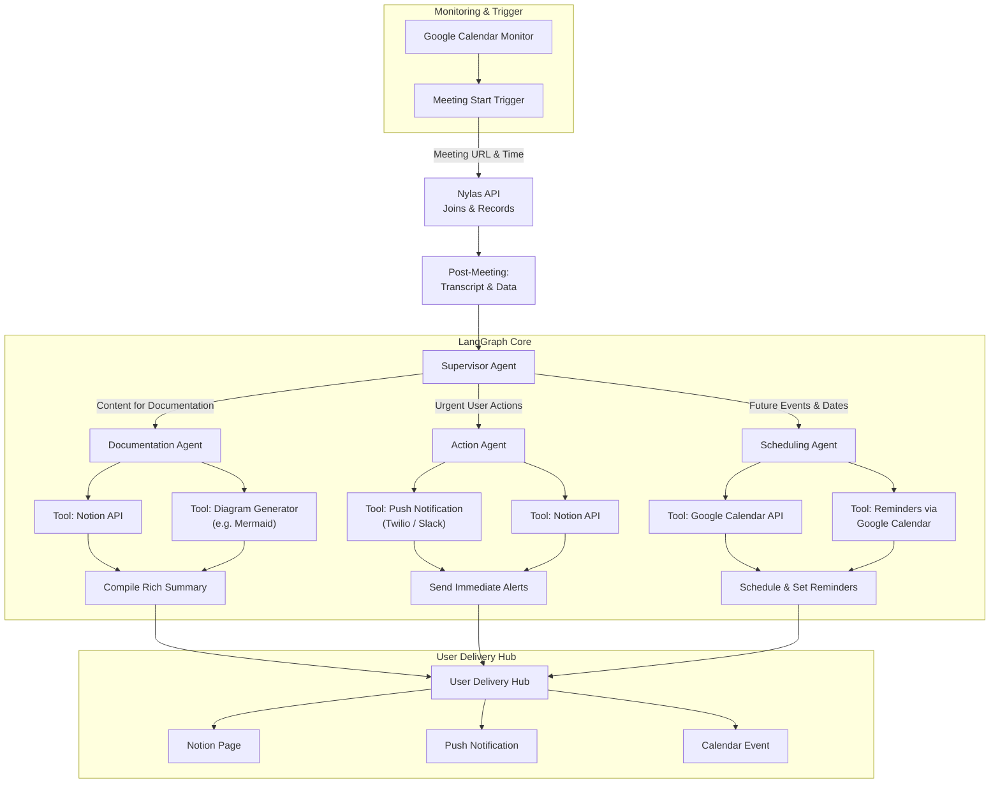

# SmartMeetOS

**SmartMeetOS** is an agentic system that turns meetings into actions by transcribing conversations, reasoning over decisions, and autonomously executing follow-ups using connected tools.

---

## 🧠 What it does

- Automatically joins scheduled meetings
- Transcribes audio and captures chat/messages
- Reasons over discussions to extract decisions, action items, and deadlines
- Executes actions autonomously (tasks, notifications, calendar updates)
- Tracks outcomes and prepares concise summaries for the next meeting

## Reliability / joining behavior

See [docs/meeting_joining_reliability.md](docs/meeting_joining_reliability.md) for the implemented join windows, retries, overlap behavior, failure codes, and persisted outputs.

## Nylas webhooks (recommended for transcript delivery)

Nylas can push `notetaker.media` events (processing/available) so you can download transcripts as soon as they are ready without blocking the next meeting.

- Setup guide: [docs/nylas_webhooks.md](docs/nylas_webhooks.md)
- Local receiver: [webhook_receiver.py](webhook_receiver.py)

---

## 🏗️ Architecture Overview

